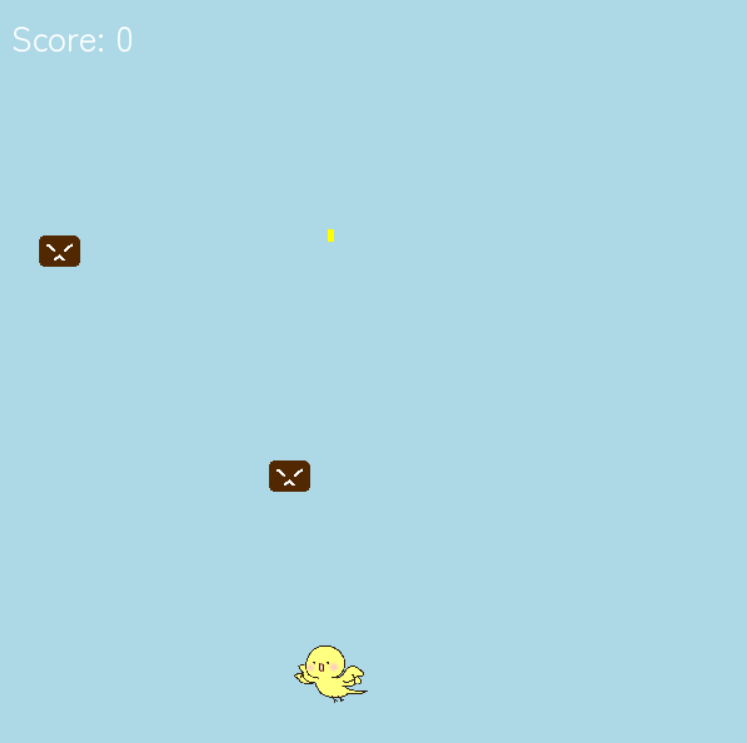
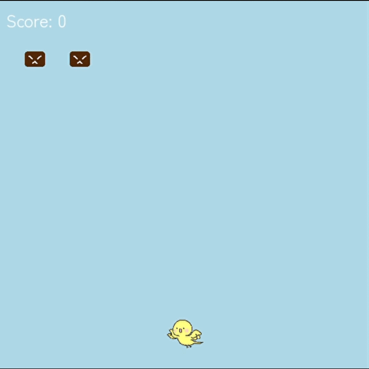

# ぴよぴよ戦士 🐥

かわいい「ぴよぴよ」が活躍するシンプルな2Dシューティングゲームです！Pygameを使って作成しています。

## 🎮 ゲーム概要

- プレイヤーは「ぴよぴよ」を操作して敵を撃退！
- スタート画面で名前を入力してゲーム開始。
- 敵を倒すとスコアが増加。ゲームオーバー後はスコアランキングも表示されます。

  

## 🎬 ゲームデモ（GIF）

ゲームのプレイデモです！どんな感じで遊べるか見てください



## 🕹️ 操作方法

 キー           操作内容                          
-------------------------------------------------
 ← / →          左右移動                          
 スペースキー    弾を撃つ                          
 Enterキー    　ゲームスタート（名前入力後）      
 Rキー          再チャレンジ（ゲームオーバー時）  
 Qキー          終了（ゲームオーバー時）          

## 🚀 セットアップ方法

1. **リポジトリをクローン**
   ```bash
   git clone https://github.com/erioonishi/piyopiyosenshi_shootinggame.git
2. **仮想環境の作成（オプション）**
   ```bash
   python -m venv venv
   source venv/bin/activate  # Windowsなら venv\Scripts\activate
3. **依存ライブラリのインストール**
   ```bash
   pip install -r requirements.txt
   ※ requirements.txt がない場合以下のコマンドでPygameをインストールしてください
   pip install pygame
4. **ゲームの起動**
   ```bash
   python main.py

## 📂 ディレクトリ構成

```plaintext
piyopiyo-senshi/
├── assets/
│   ├── fonts/
│   │   └── Zen_Maru_Gothic/
│   │       └── ZenMaruGothic-Regular.ttf
│   └── images/
│       ├── piyopiyo2.png
│       ├── enemy.png
│       ├── piyo.png
│       └── piyo.gif
├── main.py                # ゲームのエントリーポイント
├── game.py                # ゲームのロジック（スコア管理、ゲームオーバー処理など）
├── player.py              # プレイヤーキャラクターの処理
├── enemy.py               # 敵キャラクターの処理
├── bullet.py              # 弾の処理
├── scores.json            # スコアを保存するJSONファイル
└── README.md              # このファイル
```

## 📂 設計図（PDF）Web上での確認のため
[PDFはこちらから見られます 📄](assets/images/shooting-diagram.pdf)

## 💡 今後のアイデア
- 難易度設定
- BGMと効果音の追加

## 🥺 ライセンス
このアプリは個人の学習目的で作成されたものであり、**商用利用を禁止**しています。  
その他の利用条件については、[LICENSE](./LICENSE) ファイルをご確認ください。

## 🙌 クレジット
- フォント: Zen Maru Gothic
- 開発: eri


